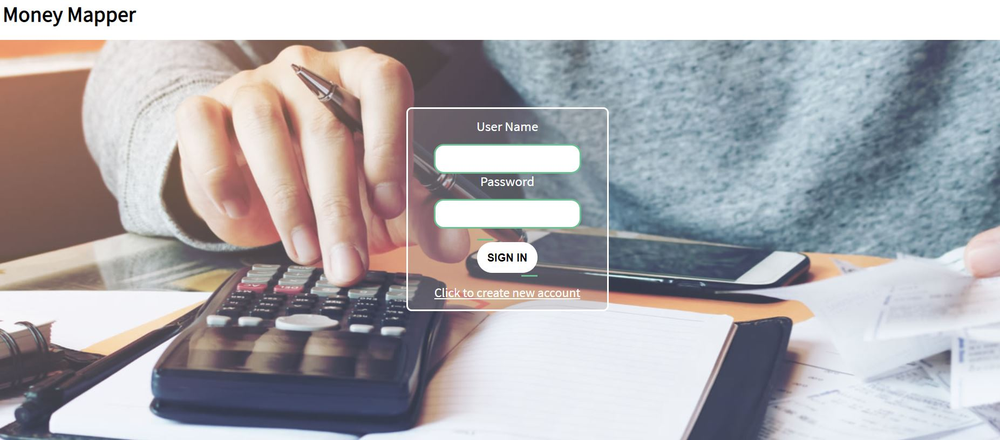
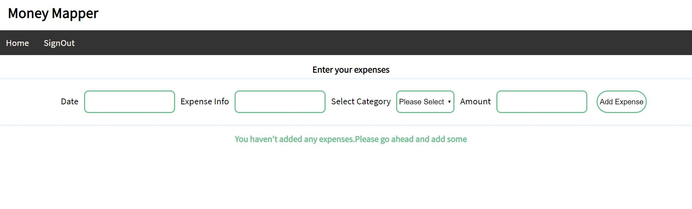
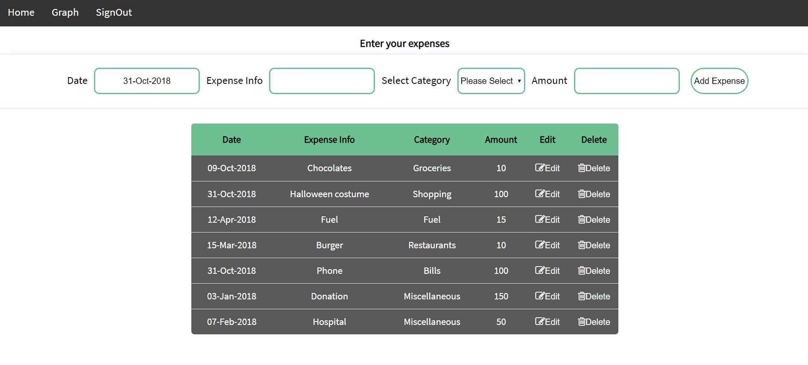
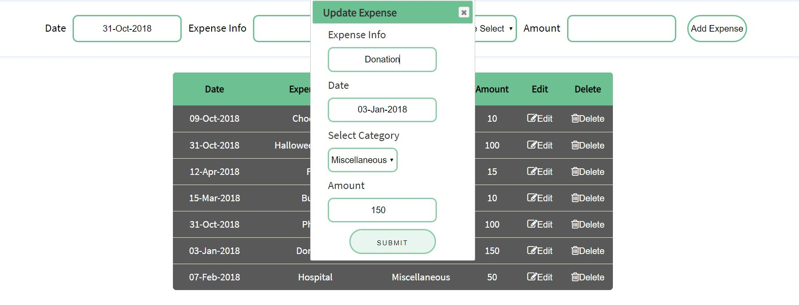
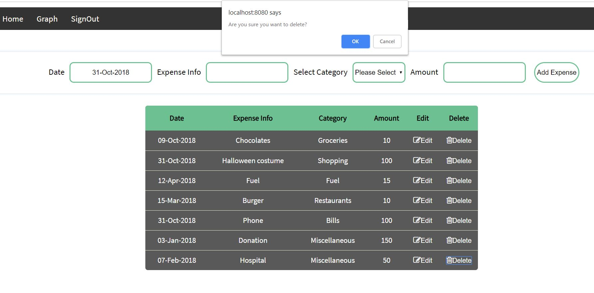
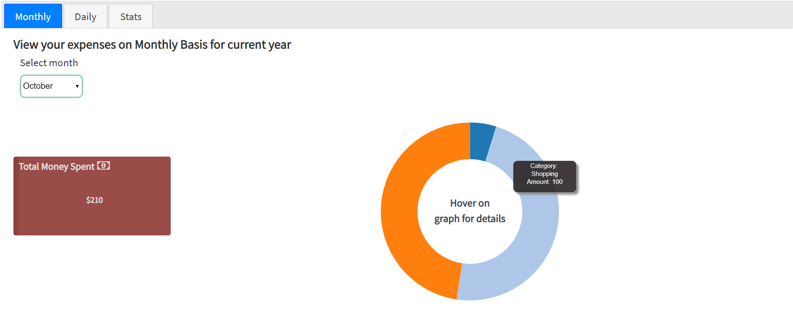
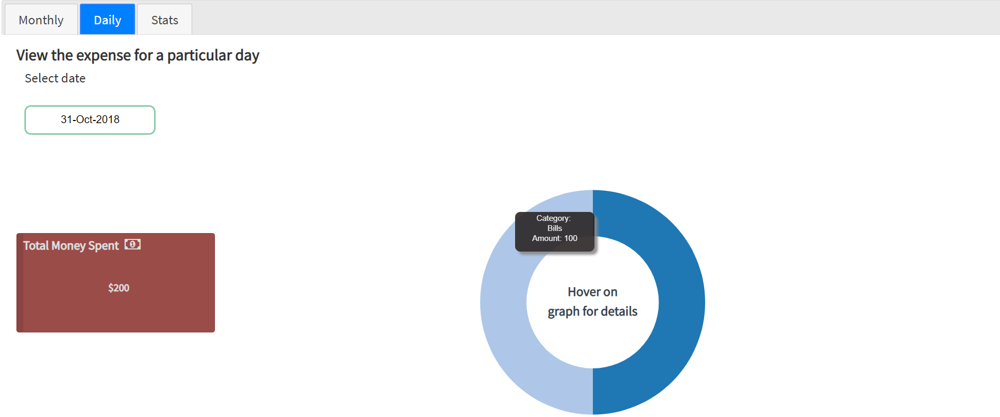
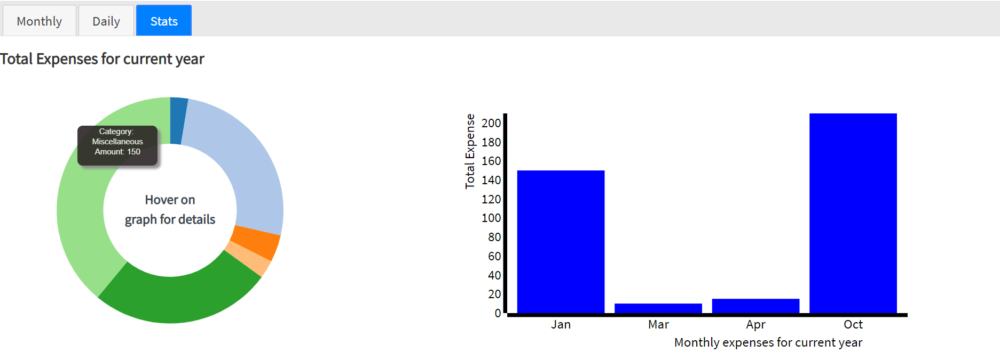

# Money-Mapper

This is an Expense tracker application built using **HTML,CSS,Javascript,Node JS,D3.js, Mongoose, Mocha and Chai**

This is the entry page where existing user need to enter the Username and Password

For new user, click on the link **Click to create new account** which returns the below page

Enter all the details and click on the button **CREATE ACCOUNT** which redirects to Login page. After successful login you will be redirected to Home screen

After adding the expenses, table is displayed as shown below

To **Edit** an expense, click on the Edit button, after which a pop up will be shown as below

To **Delete** an expense, click on the Delete button and press Ok, if you want to delete the expense or cancel if you wish to retain the expense

On click of **Graph** tab, there are 3 more tabs under it -  **Monthly, Daily and Stats**

**Monthly Tab**

If you wish to see expenses for a particular month, then select a month from the dropdown, if data is available a Donut chart will be displayed for the same, indicating the category of the expenses.Hover on each colour for details like **Expense category and Amount**

**Daily Tab** 

If you wish to see expenses for a particular date, then select a date from the calendar, if data is available a Donut chart will be displayed for the same, indicating the category of the expenses.Hover on each colour for details like **Expense category and Amount**

**Stats Tab**

This tab displays Donut chart for overall expenses incurred for the year till date and a Bar graph indicating the expenses incurred each month

Finally if you wish to Sign out, click the **SignOut** button, in the **Home page**

